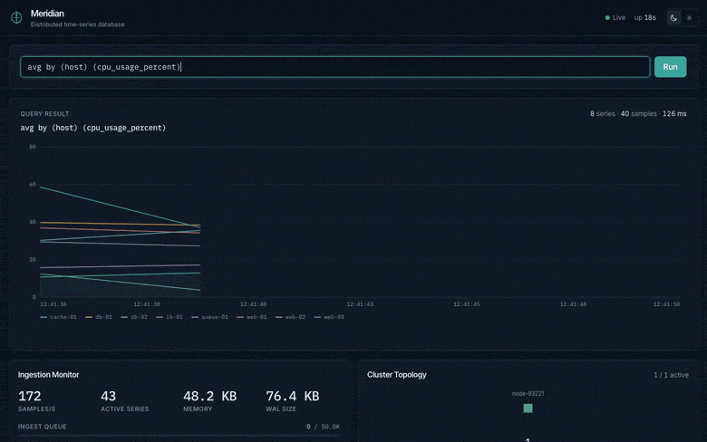
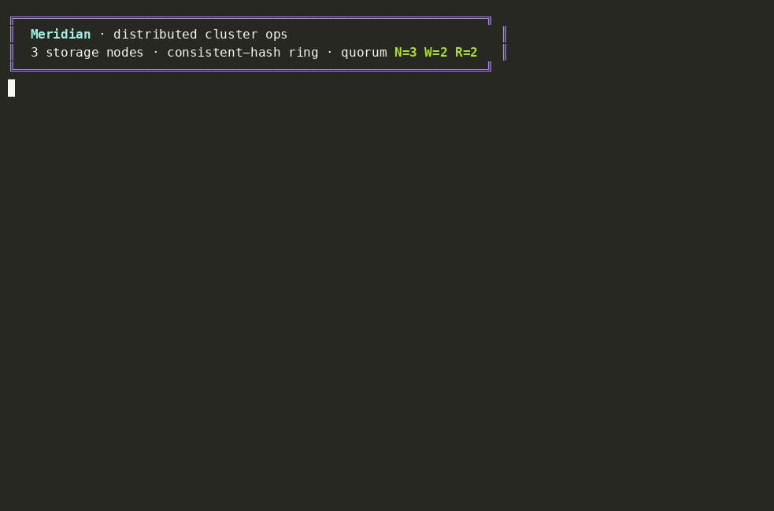

<div align="center">

# Meridian

**Distributed time-series database in Go: Gorilla compression, a PromQL query engine, quorum-replicated hash-ring clustering, and a canvas-rendered live dashboard.**

<!-- build / release -->
[](go.mod)
[](CHANGELOG.md)
[](LICENSE)
&nbsp;
<!-- quality -->
[](#development)
[](#development)
[](#development)
&nbsp;
<!-- scale -->


[](DECISIONS.md)

<!-- architecture strip -->


</div>



## What is Meridian?

A time-series database that ingests metrics, stores them compressed and crash-consistently, and answers PromQL queries. It runs either as a **single binary** or as a **quorum-replicated cluster** of small services. The storage engine, query engine, and distribution layer are built from scratch with no external storage or query dependencies, and documented across [31 ADRs](DECISIONS.md). A canvas-rendered React dashboard streams it all live over WebSockets.

## Features

Each row links to the architecture decision records that specify it.

| Area | Highlights | ADRs |
| --- | --- | --- |
| **Query** | Stepped PromQL: range/matrix evaluation, `rate`, `histogram_quantile`, `*_over_time`, `topk`/`bottomk`, `by`/`without`, vector ops with label matching | [014](DECISIONS.md), [025](DECISIONS.md) |
| **Storage** | Gorilla compression (~28x), CRC32 WAL with group commit, crash-consistent flush, inverted index | [002](DECISIONS.md), [003](DECISIONS.md), [016](DECISIONS.md), [026](DECISIONS.md) |
| **Downsampling** | Live raw / 1m / 1h rollup cascade, query-time resolution selection, per-resolution retention | [011](DECISIONS.md), [025](DECISIONS.md) |
| **Distribution** | Consistent-hash ring, quorum N=3/W=2/R=2 with read-repair, hinted handoff, Merkle anti-entropy, online rebalancing | [022](DECISIONS.md), [029](DECISIONS.md), [030](DECISIONS.md), [031](DECISIONS.md) |
| **Backpressure** | Bounded block-then-shed ingest queues (HTTP 429 / TCP NACK), opt-in per-series and priority-class admission | [023](DECISIONS.md), [027](DECISIONS.md) |
| **Anomaly detection** | Per-series online detector, EWMA baseline plus a selectable seasonal Holt-Winters model, streamed live | [024](DECISIONS.md), [028](DECISIONS.md) |
| **Dashboard** | Canvas 2D strip-charts (no chart library), WebSocket streaming, dark/light themes, accessibility floor | [020](DECISIONS.md), [021](DECISIONS.md) |

Component documentation: [ARCHITECTURE.md](ARCHITECTURE.md).

## Architecture

<div align="center">


</div>

The single binary collapses ingest, storage, query, and dashboard into one process. The cluster tier splits the same code into gateway, ingestor, storage, querier, and compactor services that route over the ring. Details in [ARCHITECTURE.md](ARCHITECTURE.md); wire protocol in [PROTOCOL.md](PROTOCOL.md). The source for this diagram is [docs/assets/architecture.d2](docs/assets/architecture.d2).

## Cluster fault tolerance

A storage node is killed mid-stream: the quorum read stays complete, writes buffer as hints, and on restart hinted handoff replays and Merkle anti-entropy reconciles. Recorded from the real service binaries.



## Quickstart

```bash
# Single binary: build, start node + simulator, open the dashboard
./run.sh demo                       # http://localhost:8080

# Or the microservices cluster
docker compose up --build           # gateway + 2 ingestors + 3 storage + querier + compactor
```

```bash
# Query in PromQL (CLI or HTTP). A range query returns a matrix, one point per step.
./bin/meridian query 'avg by (host) (cpu_usage_percent)'
curl "http://localhost:8080/api/v1/query?q=histogram_quantile(0.95,rate(http_request_duration_seconds[5m]))"
websocat "ws://localhost:8080/ws/metrics"     # live stats, metrics, and anomaly frames
```

Every node exposes Prometheus `/metrics`, a `/health` probe, and JSON `/api/v1/stats`. Full API: [PROTOCOL.md](PROTOCOL.md). Configuration: [meridian.yaml](meridian.yaml).

## Performance

Measured on Apple M5 (10-core), Go 1.25.6, darwin/arm64, reproducibly via `make bench` and `./bin/meridian bench`. Method and caveats: [PERFORMANCE.md](PERFORMANCE.md).

| Area | Metric | Value |
| --- | --- | --: |
| Compression | regular integer-like gauges / continuous floats | **28.3x** / ~2x |
| Throughput | Gorilla encode / decode (best case, 1 core) | ~88M / ~132M pts/s |
| WAL group commit | fsync coalescing @ 64 / 8 concurrent writers | **~30-37x** / ~4x |
| Downsampling | wide query point reduction (8h @ 1h step) | **240x** (16 vs 3840) |

## Project layout

```
cmd/meridian/        Monolith CLI: serve, simulate, query, bench
cmd/{gateway,ingestor,storage,querier,compactor}/   Per-service binaries
internal/
  compress/          Gorilla encoder/decoder + benchmarks
  storage/           WAL, head, persistent blocks, TSDB, rollups
  query/             Lexer, parser, planner, executor
  ingestion/         TCP server, batch writer
  backpressure/      Bounded block-then-shed queue + admission shaper
  anomaly/           Streaming detector (EWMA + Holt-Winters)
  cluster/           Hash ring, coordinator, node lifecycle
  service/           Service-to-service RPC, quorum client, handoff/anti-entropy
  retention/         TTL enforcer, downsampler
  server/            HTTP API, WebSocket hub, /metrics exporter
  config/            YAML config (with d/w duration suffixes)
simulator/           Metric generation with diurnal patterns + spikes
dashboard/           React + TypeScript + Tailwind + Canvas 2D
scripts/demo/        Tooling that captures the GIFs above (Playwright, asciinema, agg)
```

~17.4k lines of Go across 12 internal packages and 6 binaries, plus ~12k lines of test (**351 tests**, race-clean, 71.1% coverage) and a ~3.3k-line canvas dashboard.

## Documentation

[ARCHITECTURE.md](ARCHITECTURE.md) (components) &middot; [DECISIONS.md](DECISIONS.md) (31 ADRs) &middot; [PROTOCOL.md](PROTOCOL.md) (wire protocol) &middot; [PERFORMANCE.md](PERFORMANCE.md) (measured numbers) &middot; [CHANGELOG.md](CHANGELOG.md)

## Development

```bash
make test       # all tests with the race detector
make bench      # compression + query benchmarks
make dashboard  # build the React dashboard
```

## License

[MIT](LICENSE) &copy; 2026 qflen
