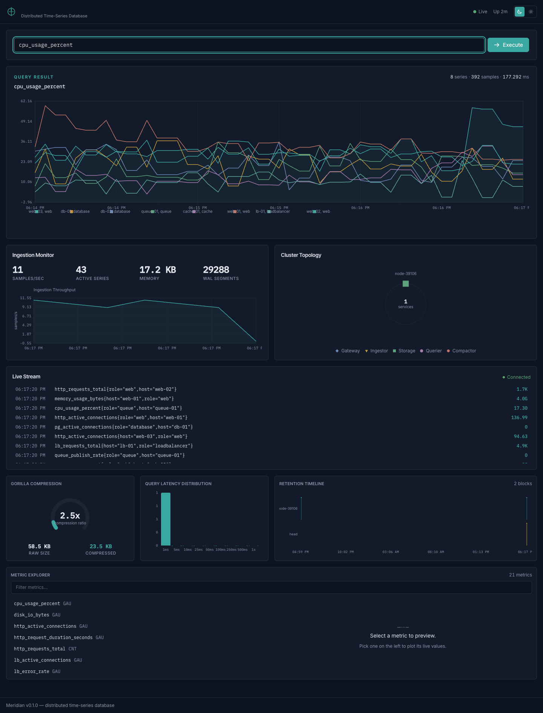

# Meridian

A distributed time-series database written in Go with a real-time React dashboard.

Meridian implements Facebook's Gorilla compression, a PromQL-subset query engine,
consistent-hash clustering, automatic downsampling, and a canvas-rendered
monitoring dashboard. It ships as a single binary with minimal dependencies.



## Quick Start

```bash
# Build everything, start server + simulator, open the dashboard
./run.sh demo
```

Step by step:

```bash
make build dashboard

./bin/meridian serve &
./bin/meridian simulate &          # 8 hosts × 43 metrics, diurnal patterns

open http://localhost:8080

./bin/meridian query "rate(http_requests_total[5m])"
./bin/meridian query "avg by (host)(cpu_usage_percent)"
```

## Measured Performance

Apple M5 (10-core), Go 1.25.6, single core, `./bin/meridian bench`
(1 M samples, regular-interval, integer-like values):

| Metric              | Value            |
| ------------------- | ---------------- |
| Compression ratio   | **28.3×**        |
| Space savings       | 96.5%            |
| Bits per sample     | 4.5              |
| Encode throughput   | ~88 M points/s   |
| Decode throughput   | ~132 M points/s  |
| Encode latency      | ~11 ns/point     |
| Decode latency      | ~8 ns/point      |

Ratio, savings, and bits/sample are deterministic (the benchmark uses a fixed seed).
Encode/decode throughput is a warm single-core figure that varies with thermal state —
roughly 45–90 M points/s (encode) and 65–135 M points/s (decode) across runs. The
28.3× ratio is best-case for regular, integer-like gauges; continuously varying float
series compress closer to ~2× (see [PERFORMANCE.md](PERFORMANCE.md)). Live compression
figures (blocks + in-memory head) are exposed on `/api/v1/stats`, `/metrics`, and the
dashboard's compression gauge.

## Features

### Storage Engine
- **Gorilla compression**: delta-of-delta timestamps + XOR float encoding
- **Write-ahead log**: CRC32-framed, 128 MB segment rotation, fsync per write;
  corrupt frames resync to the next 8-byte boundary instead of discarding the rest
  of the segment
- **Crash-consistent flush**: an atomic head-swap + WAL-rotate cut, a block written
  via temp-dir → fsync → atomic rename, and a per-block WAL low-water-mark so a crash
  mid-flush neither loses concurrently-ingested samples nor double-counts on replay
- **Out-of-order policy**: samples older than a series' last are rejected and counted
  (`meridian_out_of_order_samples_total`); duplicates are deduplicated — so series
  stay sorted and block/retention time bounds never invert
- **Inverted index**: sorted-slice intersection, no external bitmap dependencies
- **Block storage**: ULID-named immutable blocks with a binary index

### Query Engine
- **PromQL subset**: recursive-descent parser with operator precedence and unary `+`/`-`
- **Range/matrix evaluation**: a query is evaluated as an instant query at each `step` across `[start, end]` and returned as a matrix — one point per step per series, in time order. `rate(x[5m])` is a real multi-point series, not a single number.
- **Selectors**: instant, range, and bare label-only (`{job="x"}`); matchers `=`, `!=`, `=~`, `!~`; compound/decimal durations (`1h30m`, `1.5h`)
- **`rate()`**: per-second average over the selector range — counter-reset corrected and extrapolated to the window edges, Prometheus-style
- **`histogram_quantile()`**: linear interpolation within cumulative `le` buckets, grouped by the remaining labels
- **Aggregations**: `sum`, `avg`, `min`, `max`, `count`, and `topk`/`bottomk`, with both `by` and `without` grouping
- **Binary ops**: scalar↔vector and vector↔vector with label-set matching; `/` follows IEEE-754 (`x/0 → ±Inf`, `0/0 → NaN`)

Each step is a self-contained instant evaluation: an instant vector takes the most
recent sample within a 5-minute look-back (a gap stays a gap, never a zero), and a
range vector `x[5m]` takes the half-open window `(t-5m, t]`. An unset `step`
auto-sizes so the range yields ~250 points; the step count is capped to bound work
and pre-empt a query-of-death. Each leaf selector's data is fetched once over the
whole range and sliced per step, so cost scales with steps, not with re-queries.

### Cluster (microservices tier)
- **Consistent-hash ring**: a 64-bit SHA-256 ring with virtual nodes and a
  deterministic nodeID tie-break, so replica placement is a function of membership,
  not of node-join order. It is the single routing source, built from the configured
  storage nodes, and shared by the ingestor and querier so writes and reads agree.
- **Quorum replication (N/W/R)**: each series is written to its **N** ring replicas
  and succeeds at **W** acks; reads take **R** responses, merge and dedupe by
  (series, timestamp), and asynchronously **read-repair** stale replicas. Defaults
  N=3, W=2, R=2 — `W+R>N` gives read-your-writes. A node loss doesn't lose data: the
  surviving replicas serve complete reads, and a recovered node is caught up by
  read-repair. Too few live replicas returns a clear quorum error, never silent
  partial data. (ADR-022.)
- **Health-driven membership**: a background `/health` monitor marks nodes
  active/dead so routing excludes the dead and re-includes the recovered. Graceful
  `joining`/`leaving` with hinted handoff and rebalancing are future work — the ring
  reserves those states but nothing assigns them yet.
- **Scope**: this applies to the docker-compose tier (ingestor/storage/querier). The
  single-binary `serve` is genuinely single-node.

### Write-path backpressure
- **Bounded ingest queues**: every ingest path — the monolith batch writer, the
  ingestor's submission pool, and the storage accept queue — sits behind a queue
  bounded in samples, so resident memory is capped instead of growing under overload.
  Queue depth ≈ arrival_rate × service_time (Little's Law), so bounding depth bounds
  both memory and tail latency.
- **Block-then-shed**: a full queue blocks the producer for up to a short deadline
  (the backpressure); past it the batch is **shed** — dropped and counted — and the
  producer is NACKed: **HTTP 429 + `Retry-After`**, or a clear NACK on the raw-TCP
  path. A stalled replica (quorum write) or slow WAL fsync propagates backpressure
  upstream rather than OOMing, and a counted drop beats a silent OOM. (ADR-023.)
- **Observable**: `meridian_dropped_samples_total`, ingest queue depth/capacity, and
  shed/backpressure-event counters on `/metrics`; queue depth + a derived drop rate on
  `/api/v1/stats` and the dashboard load view, which the simulator's spikes drive.

### Streaming anomaly detection
- **Per-series online detector**: single-pass and O(1) state per series, run inline
  in the broadcast loop. Each series tracks an **EWMA baseline + dispersion**; a point
  is flagged when its *local* z-score `|value − baseline| / dispersion` exceeds a
  threshold (~3–4). The moving baseline tracks the simulator's **diurnal swing and
  memory drift without alerting**, while an injected **spike** departs sharply from it
  and **does** alert — where a naive global mean/z-score would flag the whole diurnal
  peak. (ADR-024.)
- **Robust by construction**: a Welford warmup seeds the baseline before any alert; a
  Huber clamp bounds a spike's pull on the baseline/dispersion (so it can't blind the
  detector); a relative scale floor stops a momentarily-flat series from looking
  anomalous; debounce + hysteresis and timestamp dedup prevent alert storms; stale
  series are evicted so memory follows live cardinality.
- **On the wire and the screen**: raise/clear transitions stream as a distinct
  `anomaly` WebSocket frame and into a bounded recent-buffer (`/api/v1/anomalies`) for
  late-joining clients; the dashboard's **Anomalies** strip lists them most-recent-first
  and clears each as it recovers. `meridian_anomalies_total` and
  `meridian_active_anomalies` are on `/metrics` and `/api/v1/stats`. Runs uniformly in
  the monolith and the cluster gateway.

### Dashboard
- **Canvas-rendered**: charts drawn directly on the Canvas 2D API, no chart library
- **11 components**: query editor, time-series chart, metric explorer, cluster topology, ingestion monitor, compression gauge, latency histogram, retention timeline, live stream, anomalies strip, theme toggle
- **Real-time**: WebSocket streaming batched through `requestAnimationFrame`
- **Themes**: dark and light, sharing one semantic token system
- **Design**: a calm "precision instrument" visual language — three panel tiers, one accent, tabular-mono figures, self-hosted Inter Tight / Inter / IBM Plex Mono (ADR-020, ADR-021)
- **Signature chart**: the query result is a strip-chart instrument — a fine graticule, instrument tick marks, and a cursor crosshair with a live tabular-mono readout of the value under the cursor on every series
- **States & accessibility**: one shared empty / loading / error voice plus a reconnect banner; keyboard-navigable query suggestions (combobox/listbox), visible accent focus rings, and `prefers-reduced-motion` honored throughout

### Observability
- **`/metrics`**: Prometheus exposition on **every** node — the monolith and each
  microservice (gateway, querier, storage, ingestor, compactor) — so a docker-compose
  cluster is scrapeable end-to-end, not just the monolith. Storage nodes expose the
  full storage metrics (cumulative `meridian_samples_ingested_total`, out-of-order
  samples rejected, head/block stats, storage bytes by layer, compression ratio,
  query-latency histogram); the gateway also reports connected WebSocket clients;
  every ingest-bounding node exposes the flow-control families
  (`meridian_dropped_samples_total`, ingest queue depth/capacity/high-water,
  shed/backpressure-event counters — ADR-023); the monolith and gateway, where the
  anomaly detector runs, also expose `meridian_anomalies_total` and
  `meridian_active_anomalies` (ADR-024); and every service exposes `meridian_up` and
  uptime. (ADR-019.)
- **`/health`**: liveness probe for orchestrators
- **`/api/v1/stats`**: JSON snapshot of storage, WAL, ingestion, compression, and
  ingest-queue load. The `ingestion_rate` field is a live **samples/sec rate**
  averaged over a short rolling window (it tracks load and falls back to ~0 when
  idle); the monotonic cumulative count lives in the `meridian_samples_ingested_total`
  counter (ADR-017). `ingest_queue_depth`/`_capacity` and the cumulative
  `dropped_samples` expose write-path backpressure (ADR-023); `anomalies_total` and
  `active_anomalies` expose the detector (ADR-024).
- **`/api/v1/anomalies`**: the bounded recent-anomalies buffer, most-recent-first,
  so a late-joining dashboard seeds its alerts strip before live frames arrive (ADR-024).
- **Single-node honesty**: in default single-node `serve`, `/api/v1/cluster` reports
  exactly the one real node rather than fabricating zero-stat peers.

### Operations
- **Downsampling cascade**: a live raw → 1m → 1h rollup cascade (ADR-011). On each
  background pass, sealed raw blocks are rolled up to resolution-tagged 1m blocks and
  the 1m tier is chained — count-weighted, so a 1h average equals one built directly
  from raw — into 1h blocks. Every window stores min/max/sum/count/avg. In the
  single-binary `serve`, the query planner picks a resolution from the query span and
  step, so a wide view reads coarse rollup points instead of thousands of raw samples
  (the resolution test serves an 8h span at a 1h step from the 1h tier reading 16
  points versus 3840 raw over the span — a 240× reduction), transparently to the
  caller; the HTTP API reports the chosen `resolution_ms`/`points_read`, and `rate()`
  and range selectors force raw. **Cluster caveat:** in the docker-compose tier the
  storage nodes generate the same rollups, but the querier still reads raw — pushing
  the chosen resolution across the remote storage client is not yet wired, so cluster
  resolution selection is documented future work (ADR-011).
- **Per-resolution retention**: each tier has its own TTL — raw expires first while
  the longer-lived 1m/1h tiers keep answering long-range queries (default raw 15d →
  1m 30d → 1h 365d). Raw is never dropped before the finest rollup tier has captured it.
- **Simulator**: diurnal patterns, spike injection, memory drift across 8 hosts

## Architecture

```
HTTP/WS ─→ Query Engine ─→ TSDB (Head + Blocks)
  │                            │
  ├── Dashboard (React)        ├── WAL (CRC32)
  ├── REST API                 ├── Gorilla Compression
  ├── /metrics (Prometheus)    └── Inverted Index
  └── WebSocket Hub                │
                                   │
TCP Ingestion ─→ BatchWriter ──────┘
                                   │
Cluster Ring ──→ Coordinator ──────┘
```

See [ARCHITECTURE.md](ARCHITECTURE.md) for detailed component documentation.

## API

```bash
# Query (rolling 15-min window by default)
curl "http://localhost:8080/api/v1/query?q=cpu_usage_percent"

# Range query → matrix (one point per step across [start,end]); step is optional
curl "http://localhost:8080/api/v1/query?q=rate(http_requests_total[5m])&start=<ms>&end=<ms>&step=30s"

# Series & labels
curl "http://localhost:8080/api/v1/series"
curl "http://localhost:8080/api/v1/labels"
curl "http://localhost:8080/api/v1/label/__name__/values"

# Storage / cluster / blocks
curl "http://localhost:8080/api/v1/stats"
curl "http://localhost:8080/api/v1/cluster"
curl "http://localhost:8080/api/v1/blocks"

# Recent anomalies (most-recent-first, with total/active counters)
curl "http://localhost:8080/api/v1/anomalies"

# Prometheus-scrapeable self-metrics
curl "http://localhost:8080/metrics"

# Live WebSocket stream — stats, per-series metric, and `anomaly` frames
websocat "ws://localhost:8080/ws/metrics"
```

See [PROTOCOL.md](PROTOCOL.md) for the full wire protocol.

### CORS & request safety

- **CORS**: cross-origin browser requests are allowed only from configured origins.
  The default permits `localhost` / `127.0.0.1` / `[::1]` (the dashboard and its dev
  server) and nothing else — not `*`. Widen it with `server.allowed_origins`
  (monolith) or `GATEWAY_ALLOWED_ORIGINS` (gateway); a single `"*"` re-enables
  allow-all for trusted networks. (ADR-018.)
- **Query limits**: `/api/v1/query` runs under a deadline (`server.query_timeout`,
  default 30s), validates `start ≤ end`, rejects malformed `start`/`end`/`step` with
  400, and recovers a panic into a 500 (the engine separately caps the step count).
- **Static serving**: non-API paths are confined to the dashboard directory;
  directory-traversal attempts (`..`, percent-encoded or not) return 400 and never
  escape it.

## Configuration

Meridian reads `meridian.yaml` if present; unknown fields fall back to defaults.
Durations accept `ns`, `us`, `ms`, `s`, `m`, `h`, plus `d` (days) and `w` (weeks):

```yaml
server:
  query_timeout: "30s"    # max execution time for a single /api/v1/query
  allowed_origins: []     # CORS allow-list; empty = localhost only, ["*"] = all
storage:
  block_duration: "15m"   # flush head to a compressed block this often
  retention:      "15d"   # drop blocks older than this
cluster:                  # microservices tier only; W+R must exceed N
  replication_factor: 3   # N — replicas per series
  write_quorum:       2   # W — acks required for a write
  read_quorum:        2   # R — replicas a read must hear from
  virtual_nodes:      256 # ring virtual nodes per physical node
ingestion:                # write-path backpressure (ADR-023)
  queue_capacity:       50000   # hard ingest-queue cap in samples (memory bound)
  queue_high_watermark: 40000   # depth at which producers are flagged to throttle
  block_deadline:       "250ms" # how long a full queue blocks before shedding
  max_concurrent_writes: 64     # drain worker-pool size (ingestor/storage)
anomaly:                  # streaming anomaly detection (ADR-024)
  enabled:    true        # toggle the detector on the live path
  threshold:  3.5         # local z-score above which a sample is out-of-band
  alpha:      0.1         # EWMA smoothing in (0,1]; smaller = steadier baseline
  warmup:     20          # samples used to seed a baseline before any alert
  debounce_k: 2           # consecutive out-of-band samples required to raise
```

The microservice binaries read the same knobs from the environment: replication
(`REPLICATION_FACTOR`, `WRITE_QUORUM`, `READ_QUORUM`, `VIRTUAL_NODES`) — clamped to
the live node count so a cluster smaller than N still works — backpressure
(`INGEST_QUEUE_CAPACITY`, `INGEST_QUEUE_HIGH_WATERMARK`, `INGEST_BLOCK_DEADLINE`,
`MAX_CONCURRENT_WRITES`; the storage node uses the `STORAGE_*` equivalents) — and the
gateway's anomaly detector (`GATEWAY_ANOMALY_ENABLED`).

## Docker

```bash
# Single node
docker build -t meridian .
docker run -p 8080:8080 -p 9090:9090 meridian

# 3-node microservices cluster (gateway + 2 ingestors + 3 storage + querier + compactor)
docker compose up --build
```

## Project Structure

```
cmd/meridian/       Monolith CLI (serve, simulate, query, bench)
cmd/{gateway,ingestor,storage,querier,compactor}/  Per-service binaries
internal/
  compress/         Gorilla encoder/decoder + benchmarks
  storage/          WAL, head block, persistent blocks, TSDB
  query/            Lexer, parser, planner, executor
  ingestion/        TCP server, batch writer
  backpressure/     Bounded block-then-shed ingest queue (flow control)
  anomaly/          Streaming per-series EWMA anomaly detector
  server/           HTTP API, WebSocket hub, /metrics exporter
  cluster/          Hash ring, coordinator, node lifecycle
  retention/        TTL enforcer, downsampler
  config/           YAML configuration (with d/w duration suffixes)
  service/          Shared service-to-service RPC
simulator/          Metric generation with diurnal patterns
dashboard/          React + TypeScript + Tailwind + Canvas
```

## Design Decisions

See [DECISIONS.md](DECISIONS.md) for the ADRs covering key trade-offs:
Gorilla vs generic compression, sorted slices vs roaring bitmaps, JSON vs protobuf
ingestion, rAF batching for WebSocket, the out-of-order sample policy, the
crash-consistent flush model, the windowed ingestion-rate vs cumulative counter, the
CORS policy, cluster-wide `/metrics`, the replication consistency model (quorum
writes/reads + read-repair), the write-path backpressure model (bounded queues with
block-then-shed load shedding), the streaming anomaly detector (EWMA baseline +
dispersion, robust to a moving diurnal baseline), and more.

## Development

```bash
make test       # all tests with the race detector
make bench      # compression + query benchmarks
make vet        # static analysis
make dashboard  # build the React dashboard
make clean      # remove artifacts
```

## License

MIT
